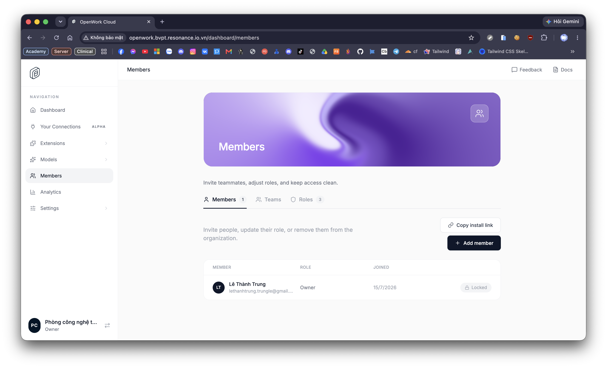
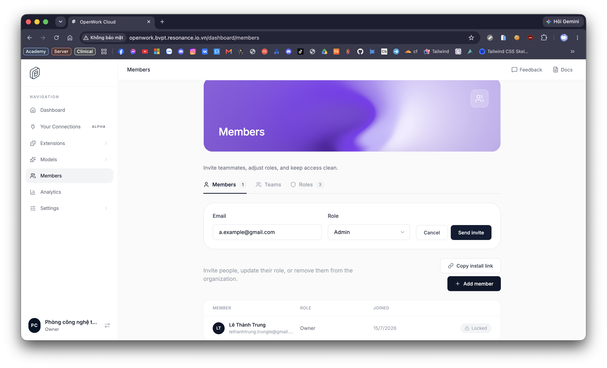
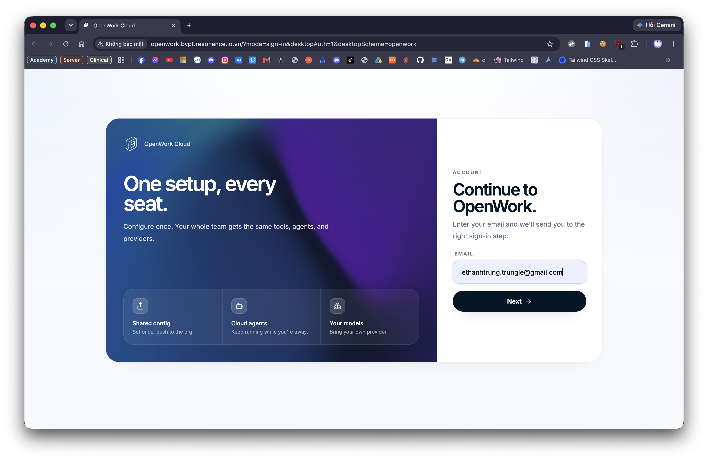
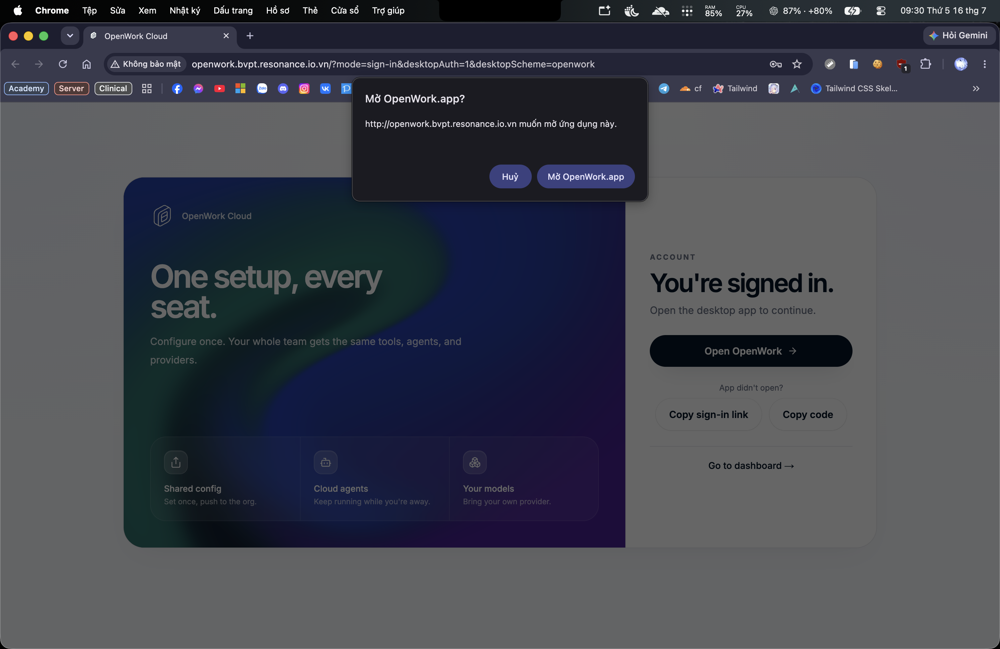
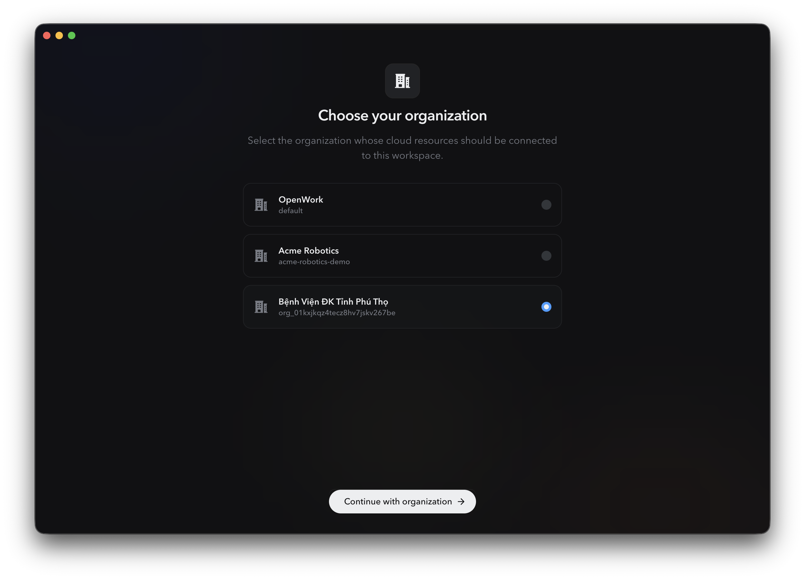
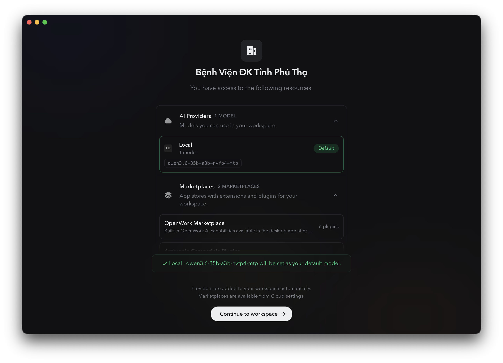
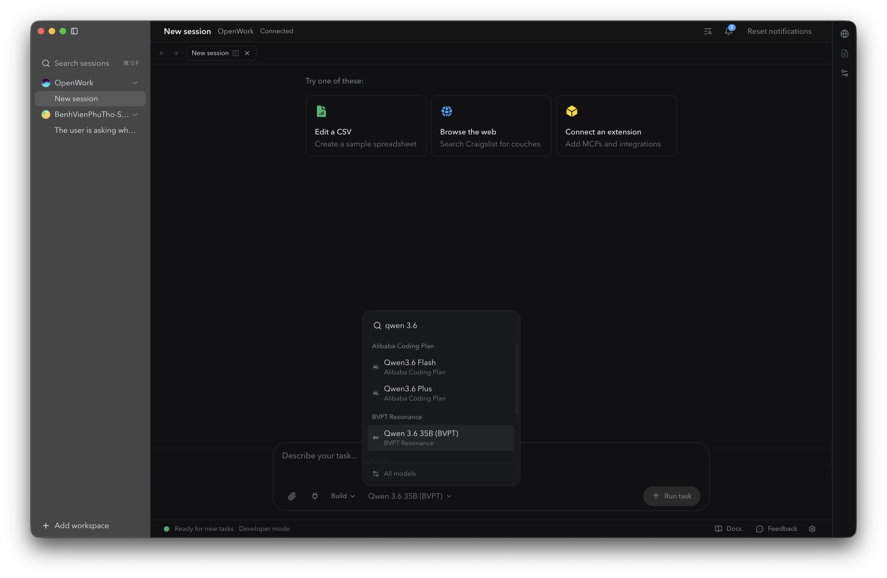
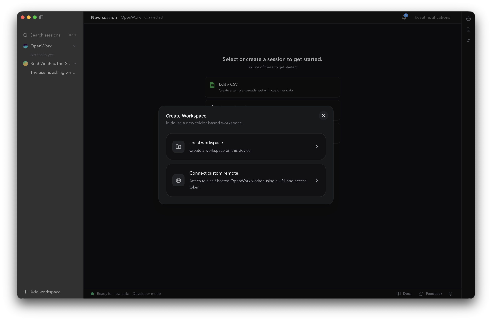
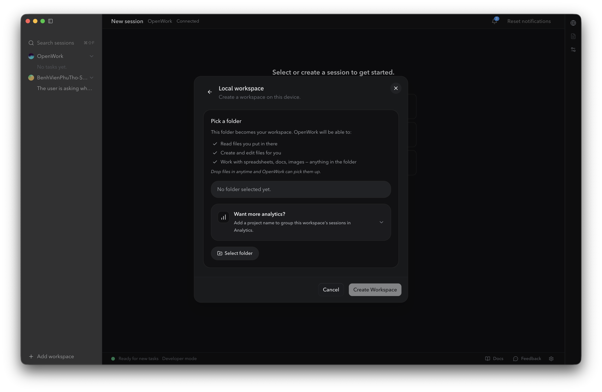
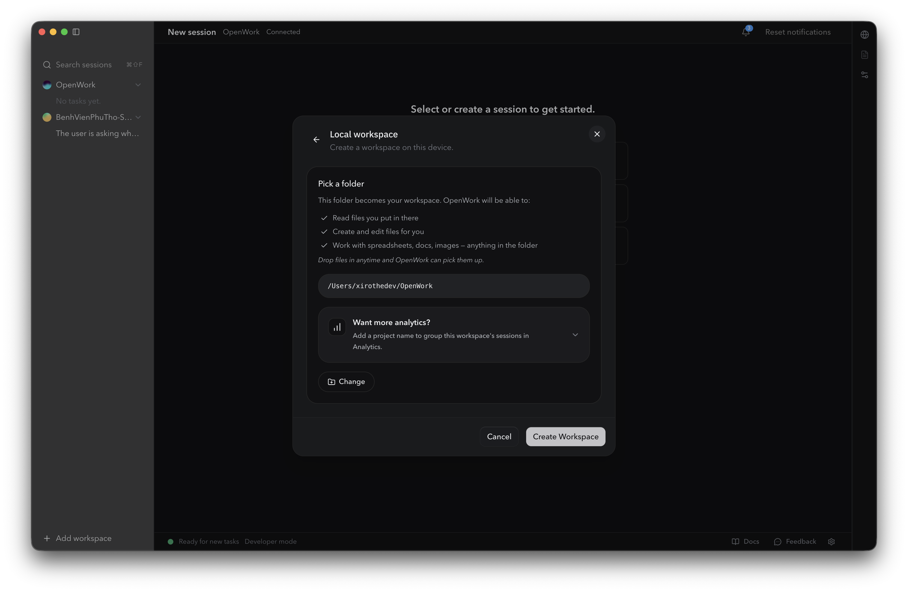

# Onboarding OpenWork Cowork — Hướng dẫn cho IT Manager

## Mục đích & phạm vi

Tài liệu này hướng dẫn IT Manager BVĐK tỉnh Phú Thọ triển khai OpenWork Cowork cho nhân viên các phòng ban: mời thành viên, cài đặt môi trường máy trạm, đăng nhập & nhận model AI nội bộ, tạo workspace, và giới thiệu cách nhân viên không rành kỹ thuật sử dụng trợ lý AI qua các skill có sẵn trong repo này.

**Giả định:** tổ chức (org) **"Bệnh Viện ĐK Tỉnh Phú Thọ"** trên OpenWork Cloud đã được khởi tạo sẵn. Tài liệu bắt đầu từ bước mời thành viên, không bao gồm tạo org lần đầu.

> 🔒 Ảnh chụp màn hình trong tài liệu này lấy từ một lần đăng nhập thật để đảm bảo đúng giao diện. Vài ảnh còn hiện email cá nhân của người quản trị — chấp nhận được vì repo do chính người đó sở hữu, nhưng lưu ý repo này **public**: cân nhắc thay bằng ảnh chụp mới (che email) nếu muốn ẩn danh hoàn toàn trước khi chia sẻ rộng.

---

## 1. Mời thành viên vào OpenWork

Truy cập: `http://openwork-bvpt.resonance.io.vn/dashboard/members`

Các bước:

1. Đăng nhập OpenWork Cloud với tài khoản quản trị (admin/owner của org).
2. Vào **Dashboard → Members**.
3. Chọn **+ Add member**.
4. Nhập **Email** nhân viên, chọn **Role** (mặc định `Admin`; hạ xuống role thấp hơn nếu có tuỳ chọn phù hợp hơn cho nhân viên thường).
5. Chọn **Send invite** — nhân viên nhận email, làm theo hướng dẫn để tạo tài khoản.


*Trang **Members**: danh sách thành viên hiện tại, nút **+ Add member** và **Copy invite link**.*


*Bấm **Add member** hiện form nhập **Email** + **Role**, có **Cancel** / **Send invite**.*

### Cách mời theo phòng ban

Mời theo từng đợt, mỗi đợt là một phòng ban (để dễ theo dõi ai đã được mời, ai chưa):

- Phòng Hành chính quản trị (HCQT)
- Phòng Điều dưỡng
- Phòng Quản lý chất lượng (QLCL)
- Phòng Công nghệ thông tin (CNTT)
- Phòng Kế toán dự án (KTDA)
- Phòng Vật tư – TBYT
- Phòng Tổ chức cán bộ (TCCB)
- Phòng Đào tạo
- Phòng NCKH&HTQT

> ⚠️ **Giới hạn nền tảng hiện tại:** OpenWork **chưa hỗ trợ phân quyền skill theo từng phòng/team trong org** (tab **Teams**/**Roles** trên trang Members hiện chỉ nhóm thành viên, chưa điều khiển việc skill/plugin nào hiển thị cho ai). Nghĩa là mọi thành viên được mời — bất kể phòng ban nào — sẽ nhìn thấy **toàn bộ** danh sách skill đã đồng bộ (`phong-hcqt`, `phong-dieu-duong`, `phong-qlcl`, `phong-cntt`, `phong-ktda`, `phong-vattu`, `phong-tccb`, `phong-dao-tao`, `phong-nckh-htqt`, `officecli`...), không chỉ skill của phòng mình. Việc mời theo phòng ban ở trên chỉ phục vụ mục đích theo dõi tiến độ mời, **không** phải cơ chế kiểm soát truy cập. Khi OpenWork bổ sung tính năng phân quyền theo team, cập nhật lại mục này.
>
> ✅ **Cách khắc phục hiện có (cài cục bộ theo máy):** xem [phan-quyen-skill-theo-phong.md](./phan-quyen-skill-theo-phong.md) — thu hẹp marketplace cấp org + `setup.ps1 -Department <phòng>` để mỗi máy chỉ có skill của phòng mình.

---

## 2. Cài đặt môi trường máy trạm (`setup.ps1`)

Script: [`setup.ps1`](../setup.ps1) tại gốc repo. Cài: Node.js, Python 3.12, OfficeCLI, OpenCode, OpenWork (desktop app).

**Ai chạy:** IT Manager chạy từ xa trên từng máy nhân viên (remote session nội bộ, hoặc chia sẻ qua thư mục mạng nội bộ). Nhân viên không rành kỹ thuật **không tự chạy PowerShell**.

Các bước script tự làm (không cần can thiệp thủ công):

1. Tự nâng quyền admin (elevate) nếu chưa chạy với quyền quản trị.
2. Set Execution Policy `RemoteSigned` cho CurrentUser.
3. Cài Node.js (winget → choco → MSI trực tiếp, theo thứ tự ưu tiên).
4. Cài Python 3.12 (winget → choco → installer trực tiếp).
5. Cài OfficeCLI (npm → winget → choco → install script).
6. Cài OpenCode (npm → winget → choco → install script).
7. Cài OpenWork desktop app — script tự gọi GitHub Releases API (`different-ai/openwork`) để lấy **bản mới nhất**, tải asset `openwork-win-x64-*.exe` tương ứng rồi cài. Không hardcode số phiên bản trong script, nên **không cần sửa `setup.ps1` hay tài liệu này mỗi khi OpenWork ra bản mới** — chỉ cần cập nhật nếu tên repo hoặc quy ước đặt tên asset (`openwork-win-x64-*.exe`) thay đổi.
8. **Chọn phòng ban → cài skill của phòng lên máy đó** (bước [7/8]). Script hiện menu đánh số 9 phòng; gõ số phòng của máy đang cài rồi Enter. Máy chỉ nhận skill của đúng phòng — xem [phan-quyen-skill-theo-phong.md](./phan-quyen-skill-theo-phong.md).
9. In tóm tắt phiên bản đã cài (Node, npm, Python, OfficeCLI, OpenCode).

Chạy lệnh:

```powershell
.\setup.ps1
```

Khi menu hiện ra, chọn đúng phòng của máy đang cài (ví dụ CNTT → gõ `4`). Cài hàng loạt bằng script thì bỏ qua menu bằng cách chỉ định thẳng: `.\setup.ps1 -Department phong-cntt`.

> ⚠️ Menu skill chỉ có tác dụng khi marketplace cấp org **không** còn đẩy toàn bộ skill (bước 1 trong [phan-quyen-skill-theo-phong.md](./phan-quyen-skill-theo-phong.md)). Chưa thu hẹp marketplace org → máy vẫn thấy đủ skill dù đã chọn phòng.

Sau khi chạy xong, khởi động lại terminal / máy nếu PATH chưa nhận lệnh mới.

---

## 3. Đăng nhập lần đầu & chọn tổ chức

Sau khi cài xong, nhân viên mở **OpenWork** từ Start Menu / Desktop shortcut.

1. Mở link mời → trình duyệt mở trang đăng nhập OpenWork Cloud.
2. Nhập đúng **email đã được mời** ở mục 1 → **Next**.
3. Trình duyệt xác nhận đăng nhập thành công → hộp thoại hệ điều hành hỏi mở ứng dụng OpenWork → đồng ý (**Mở OpenWork.app**) hoặc bấm **Open OpenWork** trên trang.
4. Ứng dụng desktop hiện màn hình **Choose your organization** → chọn **Bệnh Viện ĐK Tỉnh Phú Thọ** → **Continue with organization**.


*Trang "Continue to OpenWork" — nhập đúng email đã được IT Manager mời.*


*Sau khi đăng nhập trên trình duyệt: xác nhận mở OpenWork.app, hoặc dùng "Copy invite link"/"Copy code" nếu app không tự mở.*


*Chọn đúng **Bệnh Viện ĐK Tỉnh Phú Thọ** trong danh sách tổ chức (có thể thấy nhiều org demo khác nếu tài khoản dùng chung).*

> ⚠️ Nếu nhân viên thấy nhiều tổ chức trong danh sách (ví dụ tài khoản Google dùng chung cho nhiều việc khác), nhắc họ chọn đúng **Bệnh Viện ĐK Tỉnh Phú Thọ** — chọn nhầm org sẽ không thấy được skill hay model nội bộ của bệnh viện.

---

## 4. Model AI nội bộ & tài nguyên được cấp tự động

Bệnh viện vận hành một **model AI tự lưu trữ (self-hosted)** để đảm bảo dữ liệu bệnh nhân không rời khỏi hạ tầng nội bộ, thay vì gọi API cloud công khai.

Sau khi chọn tổ chức ở bước 3, OpenWork tự hiện màn hình tài nguyên được cấp — **không cần nhân viên hay IT Manager cấu hình gì thêm trên từng máy**:


*Provider **Local** (model nội bộ của bệnh viện) tự xuất hiện, đã có thể **"Use as default"**. Hai marketplace (OpenWork Marketplace, Anthropic-Compatible Plugins) cũng tự khả dụng. Bấm **Continue to workspace** để tiếp tục.*

Model nội bộ sau đó xuất hiện trong bộ chọn model của mọi phiên làm việc, dưới nhóm nhà cung cấp riêng của bệnh viện:


*Gõ tên model để tìm nhanh — model nội bộ nằm trong nhóm **"BVPT Resonance"** (ví dụ **Qwen 3.6 35B (BVPT)**), tách biệt với các model cloud khác như Alibaba Coding Plan.*

> 🔒 **IT Manager — không commit giá trị thật vào repo này.** Repo public trên GitHub (`The-Resonance-Team/BenhVienPhuTho-Skills`) — bất kỳ giá trị nào commit vào sẽ tồn tại vĩnh viễn trong lịch sử git kể cả khi xoá sau đó. Việc đăng ký endpoint/API key của model nội bộ chỉ thực hiện **một lần** ở cấp org trên OpenWork Cloud (ngoài phạm vi tài liệu này); nhân viên và máy trạm không bao giờ cần nhìn thấy hay nhập giá trị đó.

---

## 5. Tạo workspace lần đầu

Workspace là **thư mục trên máy** mà OpenWork được phép đọc/tạo/sửa file (docx, xlsx, ảnh...). Sau khi vào ứng dụng, nếu chưa có workspace:

1. Bấm **Add workspace** (góc dưới trái) → **Local workspace** (tạo workspace ngay trên máy) hoặc **Connect custom remote** (chỉ dùng khi có OpenWork worker tự host riêng, cần URL + access token — không áp dụng cho nhân viên thường).
2. Bấm **Select folder** → chọn hoặc tạo một thư mục cố định để lưu tài liệu công việc (ví dụ `Documents\OpenWork`).
3. (Tuỳ chọn) đặt tên project để nhóm phiên làm việc trong Analytics.
4. Bấm **Create Workspace**.


*Modal **Create Workspace**: chọn **Local workspace** cho máy trạm nhân viên thường.*


*Chưa chọn thư mục — bấm **Select folder**. OpenWork sẽ đọc/tạo/sửa mọi file trong thư mục này.*


*Sau khi chọn thư mục (ví dụ đường dẫn trên máy nhân viên), bấm **Create Workspace** để hoàn tất.*

> 💡 Khuyên dùng **một thư mục cố định theo phòng ban** (không đổi qua lại) để nhân viên luôn biết file được tạo/sửa nằm ở đâu, và để backup/sao lưu đơn giản hơn.

---

## 6. Hướng dẫn nhanh cho nhân viên không rành kỹ thuật

Nhân viên **không cần biết khái niệm "skill" hay tên skill**. Chỉ cần mô tả việc cần làm bằng tiếng Việt tự nhiên trong ô **"Describe your task..."** — trợ lý AI trên OpenWork tự chọn đúng skill phù hợp và dùng model nội bộ mặc định (mục 4). Dưới đây là ví dụ theo từng phòng ban để biết **khi nào** nên nhờ AI và **gõ như thế nào**:

| Phòng ban | Khi nào cần nhờ AI | Ví dụ câu gõ |
|---|---|---|
| Hành chính quản trị (HCQT) | Soạn tờ trình mua sắm, KHLCNT/KQLCNT, quyết định phê duyệt nhà thầu, hợp đồng hành chính, biên bản nghiệm thu, yêu cầu báo giá, dự toán, điều xe, văn phòng phẩm, đánh giá nhà cung cấp | "Soạn tờ trình dự toán mua văn phòng phẩm quý 3 cho phòng HCQT" |
| Điều dưỡng | Kế hoạch/quyết định thi tay nghề điều dưỡng-KTV, thông báo sinh hoạt khoa học, công văn điều dưỡng, phân công ban giám khảo | "Soạn quyết định tổ chức thi tay nghề điều dưỡng-KTV năm 2026" |
| Quản lý chất lượng (QLCL) | Văn bản QLCL, khảo sát & chỉ số chất lượng, báo cáo sự cố y khoa/an toàn người bệnh, đề án cải tiến chất lượng (PDCA/Lean/FMEA), nội dung đào tạo | "Soạn báo cáo sự cố y khoa tháng này theo mẫu QLCL" |
| Công nghệ thông tin (CNTT) | Mua sắm thiết bị CNTT, tờ trình dự toán/KHLCNT thiết bị, hợp đồng mua bán thiết bị, biên bản giao nhận TSCĐ | "Soạn tờ trình mua sắm máy chủ mới cho phòng CNTT" |
| Kế toán dự án (KTDA) | Chỉ định thầu dịch vụ 50–dưới 500 triệu, đơn đề xuất, thư mời báo giá dịch vụ, hợp đồng kinh tế, giấy đề nghị thanh toán | "Soạn đơn đề xuất chỉ định thầu dịch vụ bảo trì thang máy" |
| Đào tạo (ĐT&CĐT) | Xác nhận thời gian thực hành (NĐ 96/2023), chuyển giao kỹ thuật tuyến dưới, thực hành sinh viên, cử cán bộ đi học/đào tạo/hội nghị | "Làm giấy xác nhận hoàn thành thời gian thực hành cho một bác sĩ vừa thực hành xong" |
| NCKH&HTQT | Đề tài NCKH, sáng kiến, hội đồng đạo đức, hội nghị/hội thảo, cán bộ đi nước ngoài, tập san, thử nghiệm lâm sàng | "Soạn kế hoạch nghiên cứu khoa học và sáng kiến năm nay" |
| **Không cần skill nào** | Hỏi đáp thông thường, giải thích, tóm tắt văn bản đã có — không tạo file .docx/.xlsx/.pptx theo mẫu | "Tóm tắt nội dung văn bản này giúp tôi", "Giải thích quy trình X là gì" |

**Lưu ý:** khi tạo file Word/Excel/PowerPoint theo mẫu chính thức của bệnh viện, AI luôn dùng template có sẵn (`officecli merge`) — không tự bịa mẫu mới cho giấy tờ hành chính.

---

## 7. Xử lý sự cố thường gặp

| Sự cố | Nguyên nhân thường gặp | Cách xử lý |
|---|---|---|
| Chạy `setup.ps1` báo lỗi execution policy | Policy máy đang ở `Restricted` | Script tự set `RemoteSigned` cho CurrentUser ở bước 1; nếu vẫn lỗi, chạy PowerShell với quyền admin và thử lại |
| `officecli --version` không nhận lệnh sau khi cài | PATH chưa refresh trong session hiện tại | Khởi động lại terminal hoặc máy |
| Nhân viên không đăng nhập được OpenWork | Chưa nhận được / chưa chấp nhận lời mời qua email | IT Manager kiểm tra lại trạng thái invite ở Dashboard → Members, gửi lại nếu cần |
| Chọn tổ chức không thấy "Bệnh Viện ĐK Tỉnh Phú Thọ" | Đăng nhập bằng email khác với email được mời | Đăng xuất, đăng nhập lại đúng email đã nhận lời mời |
| Không thấy model nội bộ ("BVPT Resonance") trong bộ chọn model | Chưa chọn đúng tổ chức, hoặc model nội bộ chưa được đăng ký ở OpenWork Cloud | Kiểm tra lại tổ chức đang chọn; nếu vẫn thiếu, IT Manager kiểm tra cấu hình model ở cấp org trên OpenWork Cloud |
| AI không phản hồi hoặc phản hồi chậm bất thường | Model nội bộ (local model) gặp sự cố | IT Manager kiểm tra tình trạng máy chủ chạy model nội bộ |

---

## 8. Liên hệ hỗ trợ

- IT Manager / Phòng CNTT: `<điền thông tin liên hệ nội bộ>`
- OpenWork Cloud: `http://openwork-bvpt.resonance.io.vn`
